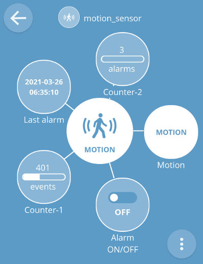
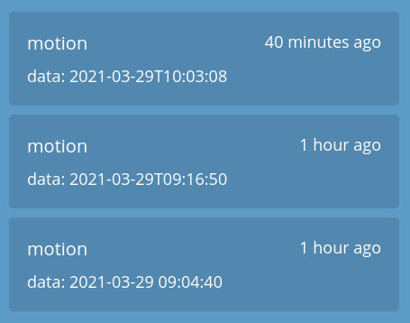

# webThing Motion Sensor

## Introduction

WebThing Motion Sensor is prepared for ESP32 CPUs and uses esp-idf environment (freeRTOS and LwIP included).

It reads the output (default GPIO18 pin) from the motion sensor and communicates with the WebThings Gateway via the WebThing API.

The example motion sensor is [here](https://wiki.dfrobot.com/PIR_Motion_Sensor_V1.0_SKU_SEN0171).

## Dependencies

Requires:

 * [web-thing-server](https://github.com/KrzysztofZurek1973/webthings-components/tree/master/web_thing_server) from ```webthings-components```

## Example

[webthings-node-example-project](https://github.com/KrzysztofZurek1973/webthings-node-example-project)

or

[webthings-empty-project](https://github.com/KrzysztofZurek1973/webthings-empty-project)

## Features



This webThing has the following properties and one event:

 * **motion** - motion detected
 * **alarm ON/OFF** - alarm activation, a notification is sent each time motion is detected
 * **counter-1** - motion detection counter, 0..5000
 * **last alarm** - time of the last sent alarm (notification)
 * **counter-2** - alarm counter, 0..99
 * **alarm notification** (event) - sent when motion detected and alarm is activated

Example event log is shown below.



## Documentation

See [webthings-empty-project](https://github.com/KrzysztofZurek1973/webthings-empty-project) and follow steps described in **Build webThing Device** chapter.

In point 5 download ```webthing-motion-sensor``` repository. In function ```init_things()``` call ```init_motion_sensor()``` and include ```webthing_motion_sensor.h``` in your main project file.

## Source Code

The source is available from [GitHub](https://github.com/KrzysztofZurek1973).


## Links

* [WebThing Gateway](https://webthings.io/gateway/) - https://webthings.io/gateway/
* [Web Thing API](https://webthings.io/api/) - https://webthings.io/api/
* [esp-idf](https://github.com/espressif/esp-idf) - https://github.com/espressif/esp-idf

## License

This project is licensed under the MIT License.

## Authors

* **Krzysztof Zurek** - [github](https://github.com/KrzysztofZurek1973)


